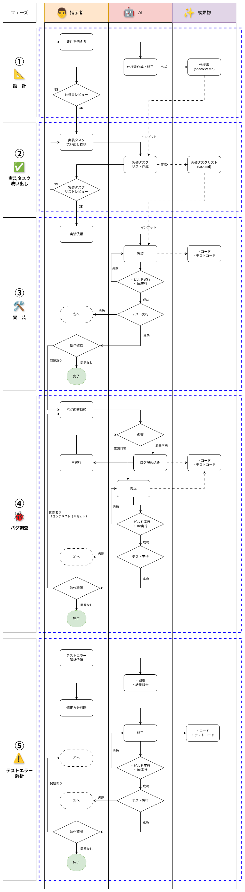

# 🟦 Agent Rules

SDD(仕様駆動開発)のための各種AIツール用のルール・スキルのテンプレートです。

### 🟠 サポートツール

- **Cursor IDE**
- **Claude Code**
- **Codex CLI**
- **Gemini CLI**

# 🟦 使い方

対象プロジェクトのルートディレクトリで、以下のコマンドを実行してください：

### 🟠 基本的な使い方

`TOOL` 環境変数でツール名を指定して実行します：

**Cursor IDE の場合:**
```bash
TOOL=cursor curl -sSL https://raw.githubusercontent.com/t-kuni/agent-rules/refs/heads/main/setup.sh | bash
```

作成されるファイル：
- `.cursor/skills/` (13 個のスキル)
- `AGENTS.md` (基本ガイダンス)

**Claude Code の場合:**
```bash
TOOL=claude curl -sSL https://raw.githubusercontent.com/t-kuni/agent-rules/refs/heads/main/setup.sh | bash
```

作成されるファイル：
- `.claude/skills/` (13 個のスキル)
- `.claude/CLAUDE.md` (基本ガイダンス)

**Codex CLI の場合:**
```bash
TOOL=codex curl -sSL https://raw.githubusercontent.com/t-kuni/agent-rules/refs/heads/main/setup.sh | bash
```

作成されるファイル：
- `.agents/skills/` (13 個のスキル)
- `AGENTS.md` (基本ガイダンス)

**Gemini CLI の場合:**
```bash
TOOL=gemini curl -sSL https://raw.githubusercontent.com/t-kuni/agent-rules/refs/heads/main/setup.sh | bash
```

作成されるファイル：
- `.gemini/skills/` (13 個のスキル)
- `GEMINI.md` (基本ガイダンス)

### 🟠 別のディレクトリに展開する場合

引数でターゲットディレクトリを指定できます：

```bash
TOOL=cursor curl -sSL https://raw.githubusercontent.com/t-kuni/agent-rules/refs/heads/main/setup.sh | bash -s -- path/to/target/project
```

### 🟠 注意事項

- セットアップスクリプトは既存ファイルを上書きします
- カスタマイズした設定は、ツールごとの個人用設定ファイル（例: `CLAUDE.local.md`）に保存してください

# 🟦 タスクをトリガーするプロンプトの一覧

### 🟠 リサーチプロンプト

```
以下についてリサーチしてください

* ここに調査内容を列挙
```

### 🟠 外部のLLMに投げる時の要件整理プロンプト

```
以下のリサーチプロンプトを作成して

* 要件
```

### 🟠 仕様検討プロンプト

```
以下を満たせる仕様を検討してください

* 達成したいこと
```

### 🟠 タスク洗い出しプロンプト

```markdown
以下を実装するタスクを洗い出してください

* ここに仕様を列挙
```

### 🟠 仕様書の変更からタスク洗い出しプロンプト

```
仕様書を更新してます。直前のコミットの差分を確認して、タスクを洗い出してください
```

### 🟠 タスク遂行プロンプト

```
タスクを遂行して下さい
```

```
差分確認： `git add -A && GIT_PAGER=cat git diff HEAD`

テスト実行： `make test`
```

### 🟠 バグの原因調査プロンプト

```
以下のバグの原因を調査してください

* バグの挙動
```

### 🟠 テストエラー解析プロンプト

```
テストのエラーの原因を調査してください
```

# 🟦 運用フロー

以下のフローに従って前述のプロンプト郡を活用する

* 青い破線を跨ぐタイミングでコンテキストをリセットする

